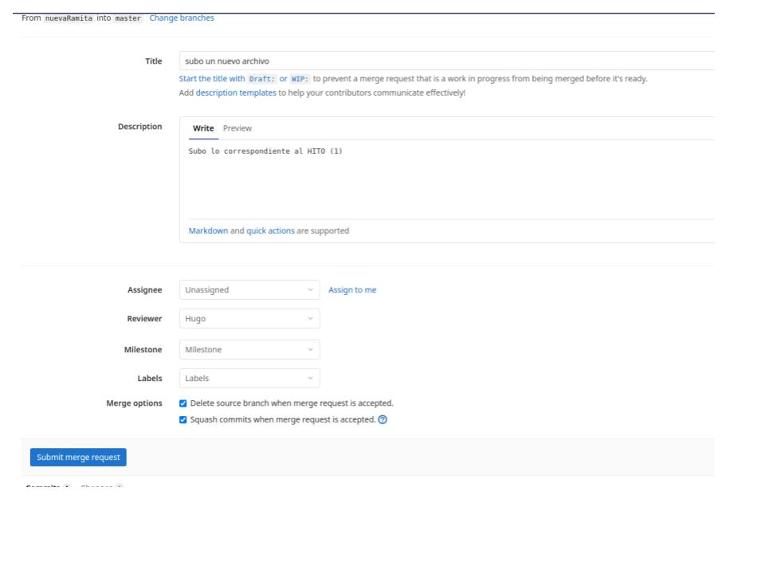
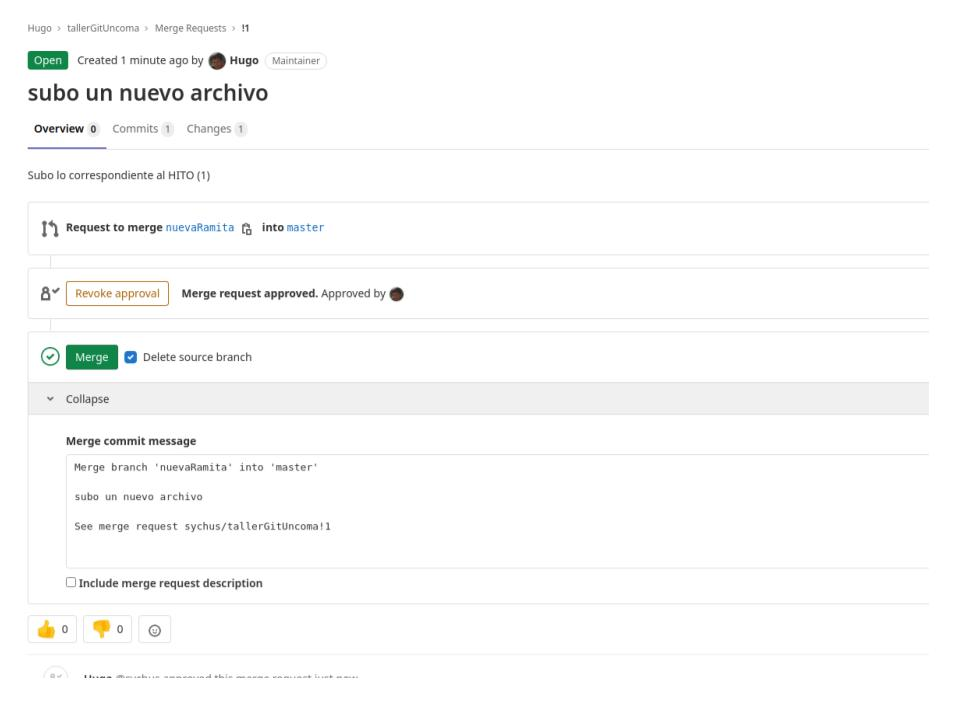

# Toolkit Project en BASH
## Herramientas del Administrador(a) de Sistemas

<p style='text-align: justify;'>Este proyecto es un conjunto de scripts que deberán ser accesibles por el/la usuario/a desde un menú en el shell. Cada opción de menú debería permitir acceder a cada una de las opciones y subopciones para ejecutar las tareas solicitadas. 
</p>

## **Importante** 
<p style='text-align: justify;'>Este trabajo final y obligatorio se dividirá en HITOS que deberán ser alcanzados de acuerdo al cronograma de entregables que está al final del documento. Cada semana, deberá ser subido a gitlab los avances realizados en el proyecto a los efectos de tener feedback por parte de la cátedra. Para instrumentar este proceso, se deberá realizar un Merge Request (ver procedimiento al final del documento) para que el trabajo realizado sea revisado por la cátedra. 
</p>

## Consideraciones
* Ud. posee permisos de administrador/a en las vms pertenecientes a los/las integrantes del grupo, por lo que algunas tareas no podrán ser evaluadas en máquinas remotas, en ese caso, deberá mostrarse una advertencia y continuar con la ejecución. Esto es, el script deberá distinguir entre ejecución en modo administrador/a o en modo usuario sin privilegios. 
* Para probar los ejercicios que demanden nuevos usuarios/as, por favor crear usuarios/as basados en su nombre de usuario/a individuales. Por ejemplo, si su nombre de usuario es lechner01, los usuarios/as de prueba serán lechner01a, lechner01b, etc. Esto nos permitirá asistirlos de manera más efectiva.
* El script recibirá opcionalmente, por algún método que ud. considere conveniente, el listado de máquinas sobre las que ejecutar las diversas tareas. Por ejemplo, podría proveerse como argumento del script principal un listado de IP, una por línea, o solicitarlo a través de la entrada estándar al usuario.
* En todos los casos, la tarea debe resolverse para una máquina individual y luego proceder a re-utilizar el código (tal vez función) creado para replicar el comportamiento en el listado de máquinas provisto. 
* Documentación: a medida que avance el script debe documentarse, esto es deberá tener comentarios explicativos de las secciones de código. Además deberá proveer un breve explicación en la cabecera del mismo.
* Proveer funcionalidad de ayuda al usuario/a final. Recomendamos utilizar el argumento -h (help) para implementar las ayudas de usuario.


## Tareas
1. Creación de un menú de opciones como principal interface del proyecto.
2. Gestión de usuarios
    * _Altas de usuarios_: Dado un listado de usuarios en un archivo csv, crear los usuarios.
    * _Cruce de claves_: Dado un listado de usuarios en un archivo csv,  se deberán cruzar (y generar en caso que no existan)  las claves de cada uno de ellos/ellas dentro del conjunto de máquinas provistas como argumento. Observe que en este caso el listado de máquinas no es opcional. 
    * _Baja de usuarios_: Dado un listado de usuarios en un archivo csv, eliminarlos del sistema. Indique qué política asume con respecto a los datos de los usuarios eliminados.
    * _Reporte de usuarios de sistema_: Elaborar un script que devuelva el listado de todos los usuarios del sistema.
    * _Reporte de usuarios activos_: Elaborar un script que devuelva el listado de todos/as los/las usuarios/as (que no sean de sistema o aplicación) habilitados para login. 
    ### Ejemplo de salida para ejecución en múltiples máquinas:
    * vmx :
        * usuarioA
        * usuarioB
        * etc
    * vmy:
        * usuarioA
        * usuarioB
        * etc

3. Gestión de discos
    * _Reporte_ de información de espacio en disco para cada servidor. Deberá mostrar: 
        * Tamaño total
        * % de utilizado
        * % disponible
        * Punto de montaje
    * _Reporte_ de rendimiento de los discos locales, en caso que la herramienta no se encuentre instalada, el script deberá notificar al usuario y ofrecerle la posibilidad de instalarla (Ayuda: sysstat).
    * _Reporte_ de actividad de I/O en todos los discos primarios de todos los servidores provistos . Deberá obtener las 	lecto/escrituras del comando que se está ejecutando en ese momento. Al igual que en el caso anterior, en caso que la herramienta no se encuentre instalada, el script deberá notificar al usuario y ofrecerle la posibilidad de instalarla (Ayuda: iotop, considere las opciones -o -n y -b).
4. Gestión de procesos
    * _Reporte_ de los primeros 5 procesos ordenados por consumo de memoria.
    * _Reportar una alerta_ si el número de procesos es superior a un umbral provisto por el usuario.

            NOTA: los ítems a continuación sólo se ejecutarán en la máquina local del script y no en máquinas remota.
    * Monitorear un proceso específico, dado un id de proceso (PID) deberá mostrar por pantalla sólo ese proceso con un límite de iteración de 10 veces.
    * Eliminar un proceso específico dado su id de proceso (PID). Debe realizar un intento de eliminarlo de manera amable; en caso de no funcionar intentar con mayor ímpetu y por último, en caso de no poder eliminarlo, emitir una advertencia. 
    * Extienda la funcionalidad del punto anterior, para eliminar una lista de procesos (PIDs) de manera de automatizar el trabajo de hacerlo uno por uno.

            Importante: Para poder probar este ejercicio, deberá crear un script aparte que ejecute 10 instancias del proceso que Ud. desee y luego deberá obtener los id de proceso de ese programa y guardarlos en un archivo para alimentar la funcionalidad descripta.
5. Gestión de la memoria
    * Reporte del uso de memoria RAM.
    * Dado el script de memory-alert.sh, deberá hacerlo funcionar modificando lo que considere necesario para recibir las alertas en su mailbox local. Luego, modifique el script para que guarde la información en un archivo temporal. (ayuda: Existe un comando para esto, investigar).
        ```bash
        #!/bin/bash
        ramusage=$(free | awk '/Mem/{printf("Uso de memoria RAM: %.2f\n"), $3/$2*100}'| awk '{print $3}')

        if [ "$ramusage" > 20 ]; then
        SUBJECT="ATENCIÓN: El uso de memoria es alto en $(hostname) at $(date)"
        MESSAGE="/tmp/Mail.out"
        TO="usuario@hostname.org"

        echo "La cantidad de memoria en uso es: $ramusage%" >> $MESSAGE
        echo "" >> $MESSAGE
        echo "------------------------------------------------------------------" >> $MESSAGE
        echo "Consumo de memoria con información de TOP" >> $MESSAGE
        echo "------------------------------------------------------------------" >> $MESSAGE
        echo "$(top -b -o +%MEM | head -n 20)" >> $MESSAGE
        echo "" >> $MESSAGE
        echo "------------------------------------------------------------------" >> $MESSAGE
        echo "Consumo de memoria con información de PS" >> $MESSAGE
        echo "------------------------------------------------------------------" >> $MESSAGE
        echo "$(ps -eo pid,ppid,%mem,%cpu,cmd --sort=-%mem | head)" >> $MESSAGE
        mail -s "$SUBJECT" "$TO" < $MESSAGE
        rm /tmp/Mail.out
        fi

        ```
6. Gestión de texto
    * Verificar que la resolución del hostname local de la máquina se encuentre correctamente configurado en la base de datos local de hosts (/etc/hosts). En caso de no estarlo deberá mostrar una advertencia.
    * Obtener un listado de servidores DNS por el medio que considere útil y verificar que los mismos se encuentren configurados, caso contrario deberán ser agregados a la configuración actual. 

## Cronograma de entregas y defensas parciales del proyecto
| Fecha de entrega y defensa | % de avance |
| :------------------------- | --------------------------: |
|Semana 19/4 (semana 6) | 33%|
|Semana 17/5 (semana 10)| 66% |
|Semana 21/6 (semana 15)| 100% |


# Instructivo Merge Request
## Pasos
1. ¿Cómo hago el Merge Request para cumplir con mi entrega?
    * Cada alumno pertenecerá a un grupo de trabajo que tendrá un repositorio asociado para llevar adelante el proyecto con todos los permisos necesarios.
        1. Clonar el repositorio desde github (si es la primera vez), caso contrario podrá saltear este paso e ir directamente al punto (2).
            * mkdir misProyectos  (es un ejemplo de nombre de carpeta)
            * cd misProyectos
            * git clone https://gitlab.com/tuassl/grupoX.git
            * cd grupoX
            * Ya estoy en mi proyecto, sólo debería ver README.md
        2. Estando en la rama main o master, siempre debo verificar que mi repositorio local se encuentre actualizado:
            * git fetch (para ver si hay nuevos cambios)
            * git pull (descargarme los nuevos cambios)
            * Si por algún motivo los git pull me trae problemas, realizar la siguiente acción: git reset --hard origin/master  (Ojo que esto sobreescribe todo lo que tengo local por lo que está en gitlab).
        3. Vamos a empezar a trabajar en la funcionalidad, por lo tanto debo hacer "SIEMPRE" mi trabajo en una nueva rama. *_NO USAR MASTER_*
            * git checkout -b _nbeRama_ es la nueva rama donde voy a trabajar y puede tener cualquier nombre. NOTA: El argumento -b es para crear la rama por primera vez, si ya la tengo creada localmente, simplemente hago git checkout _nbeRama_.
        4. Hago mis tareas de desarrollo.
        5. Una vez que me aseguro que lo que tengo funciona, hago los siguientes pasos:
            * git add .
            * git commit -m "un texto descriptivo de lo que hice"
            * git push origin _nbeRama  (esta acción va a subir mi rama actual a gitlab)
        6. Luego ir a gitlab y realizar el “Merge Request”, este proceso se realiza desde el sitio web de gitlab.
            * Pasos en Gitlab
                1. 
                2. 
                3. Miriam y Hugo realizan la siguiente tarea: 
                4. Una vez que les demos el ok, la rama será “mergeada” y deberán actualizar sus repositorios locales a los efectos de iniciar un nuevo HITO.


